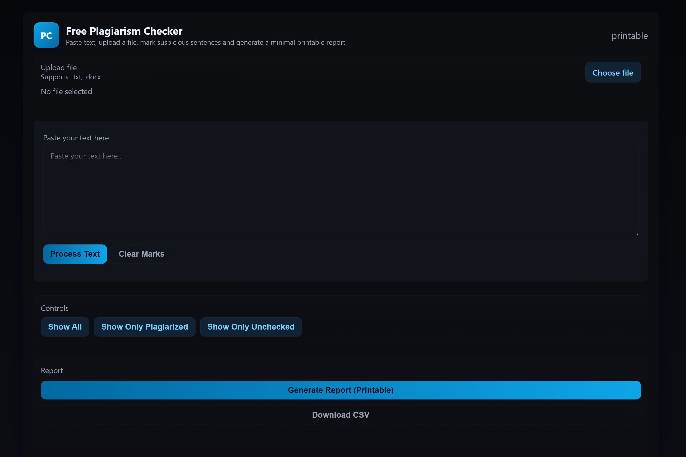

# Free Plagiarism Checker
Unlimited text, Google search links, marking, and rewrite-ready roadmap

It lets you paste unlimited text, split it into sentences, and instantly verify them with one-click search links. Unlike most free checkers, there are **no word limits** — making it fast, simple, and transparent for students, researchers, and writers.

---

## ✨ Features
- **Unlimited text checking** — no artificial word or character caps.  
- **One-click plagiarism checks** — each sentence generates a direct Google search link.  
- **Mark & filter** — flag plagiarized lines and filter by status.  
- **Persistent marks** — progress is saved in `localStorage`.  
- **Lightweight & free** — runs fully in the browser, no server required.  

---

## 🖼️ Screenshots

---

## 🛠 Planned Improvements
- **Paraphrasing suggestions** → integrate an LLM to rewrite flagged sentences, with source citation.  
- **File upload support** → accept `.docx` (via Mammoth.js), `.pdf` (via pdf.js), and plain text.  
- **Search automation** → integrate a Search API to check multiple engines automatically, while keeping manual option available.  
- **Knowledge base expansion** → go beyond just open/public web sources, add more academic/research integrations.  

---

## ⚠️ Current Limitations
- Limited to **open-source / publicly accessible information** (Google search).  
- **Not automated** — every sentence currently opens as a manual search link -> Money
- **No built-in paraphrasing** yet — rewrite tool is on the roadmap.  

---

## 📌 Why I Built This
Most “free plagiarism checkers” online have **harsh word limits** or hide results behind a paywall.  
This project was built to provide a **transparent, unlimited, and free alternative** for quick checking, especially useful for students and independent researchers.  

---

## 🚀 Roadmap
- [ ] Add **Search API integration** (Google/Bing/academic sources)  
- [ ] Implement **LLM-based paraphrase & rewrite tool**  
- [ ] Support **DOCX/PDF uploads** with heading/section parsing  
- [ ] Export/Import review results as JSON or PDF  

---

## 🤝 Contributing
Pull requests are welcome! For major changes, please open an issue first to discuss what you’d like to add.  

---

